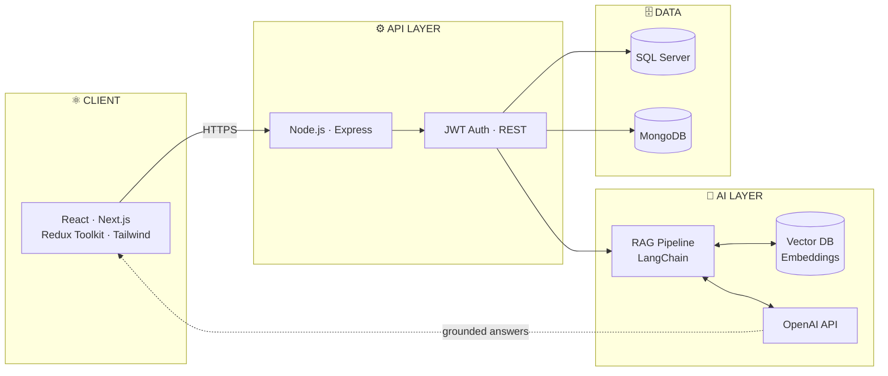
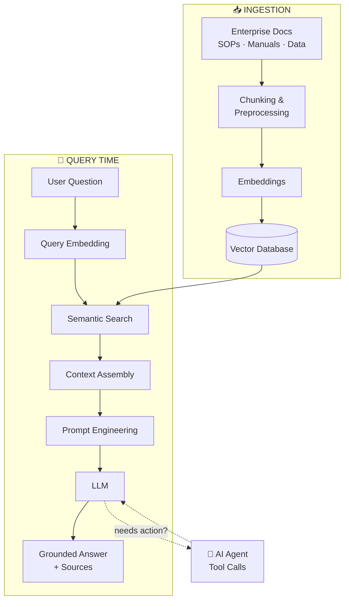
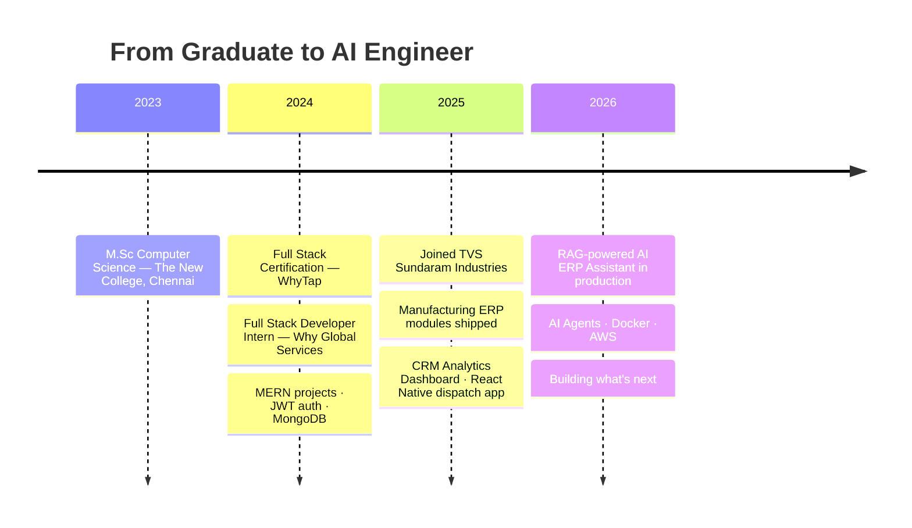

<!-- ═══════════════════════ 01 · HERO ═══════════════════════ -->
<div align="center">


<br/>

[](https://git.io/typing-svg)

<sub><code>$ whoami</code> → shipping AI features that factory teams actually use, every single day</sub>

</div>


<!-- ═══════════════════════ 02 · QUICK STATS ═══════════════════════ -->
## `> stats --live`

<div align="center">

<table>
<tr>
<td align="center" width="16%">
<br/>
<sub><b>YEARS EXP</b></sub>
</td>
<td align="center" width="16%">
<br/>
<sub><b>ERP MODULES</b></sub>
</td>
<td align="center" width="16%">
<br/>
<sub><b>PROD APPS</b></sub>
</td>
<td align="center" width="16%">
<br/>
<sub><b>AI SHIPPED</b></sub>
</td>
<td align="center" width="16%">
<br/>
<sub><b>FOLLOWERS</b></sub>
</td>
<td align="center" width="16%">
<br/>
<sub><b>CORE STACK</b></sub>
</td>
</tr>
</table>


</div>


<!-- ═══════════════════════ 03 · ABOUT ═══════════════════════ -->
## `> cat about.ts`

```typescript
interface AIEngineer {
  name: string;
  compile(): string;
}

const kaja: AIEngineer = {
  name: "Kaja Moideen",
  role: ["Full Stack Developer", "AI Engineer"],
  company: "TVS Sundaram Industries Pvt Ltd",
  experience: "2+ years — enterprise production systems",
  domains: [
    "Manufacturing ERP",      // production · planning · inventory · dispatch
    "CRM & Sales Analytics",  // BI dashboards · KPIs · reporting
    "AI Applications",        // RAG · agents · enterprise search
  ],
  frontend:  ["React", "Next.js", "TypeScript", "Redux Toolkit", "Tailwind", "Framer Motion"],
  backend:   ["Node.js", "Express", "REST APIs", "JWT Auth"],
  databases: ["SQL Server", "MongoDB", "MySQL"],
  ai:        ["OpenAI API", "LangChain", "RAG", "Vector DBs", "Prompt Engineering"],
  deploy:    ["Docker", "Vercel", "Netlify", "Render", "Cloudinary"],
  currentlyLearning: ["AI Agents at scale", "AWS", "System Design"],
  compile() {
    return "Ships AI features that factory teams use every day 🏭⚡";
  },
};

export default kaja;
```


<!-- ═══════════════════════ 04 · SKILLS MATRIX ═══════════════════════ -->
## `> skills --matrix`

<div align="center">

### ⚛️ Frontend Engineering


### ⚙️ Backend & Databases


### 🧠 AI Engineering


### 🚀 DevOps & Platforms


</div>

```text
React / Next.js      ████████████████████░  Advanced
Redux Toolkit        ███████████████████░░  Advanced
Node.js / Express    ███████████████████░░  Advanced
SQL Server           ███████████████████░░  Advanced
MongoDB              █████████████████░░░░  Proficient
RAG / LLM Pipelines  ███████████████████░░  Advanced
TypeScript           ████████████████░░░░░  Proficient
Docker               ██████████████░░░░░░░  Learning
AWS                  ██████████░░░░░░░░░░░  Learning
```


<!-- ═══════════════════════ 05 · SYSTEM ARCHITECTURE ═══════════════════════ -->
## `> architecture --render`

<div align="center"><sub>How my production systems are wired — from browser to LLM</sub></div>




<!-- ═══════════════════════ 06 · FEATURED PROJECTS ═══════════════════════ -->
## `> projects --featured`

<table width="100%">
<tr>
<td width="50%" valign="top">

### 🏭 Enterprise Manufacturing ERP

 

Full-scale ERP powering tyre manufacturing — used on factory floors daily.

`Production` `Planning` `Inventory` `Dispatch` `PDI` `Quality` `CRM` `Reports`

  

</td>
<td width="50%" valign="top">

### 🤖 AI ERP Assistant

 

RAG-powered chat over enterprise knowledge — ChatGPT-style interface for internal teams.

`RAG Pipeline` `Semantic Search` `Knowledge Base` `AI Agent`

   

</td>
</tr>
<tr>
<td width="50%" valign="top">

### 🛒 Customer Ordering Portal

 

Self-service dealer portal for tyres & rims — browse, order, and track live.

`Product Search` `Customer Login` `Live Orders` `Order Tracking` `Dealer Dashboard`

  

</td>
<td width="50%" valign="top">

### 📊 CRM Analytics Dashboard

 

Real-time sales & manufacturing intelligence — charts, KPI cards, global filtering.

`Business Intelligence` `KPIs` `Advanced Filters` `Reports`

  

</td>
</tr>
</table>

### 🌐 Open Source & Personal

| Project | Description | Stack | Link |
|:---|:---|:---|:---|
| **Multi-Vendor E-Commerce** | Marketplace with role-based access for admins, sellers & customers — led a team of 5 | MERN · Tailwind | [Live ↗](https://ecommerce.whytap.tech) |
| **Blog Platform** | Responsive blog with React Quill editor, JWT auth, pagination & caching | MERN · Tailwind | [Code ↗](https://github.com/KAJA-MOIDEEN/blog-exercise) |
| **Portfolio Website** | Next.js 15 portfolio — Three.js hero, GSAP, Framer Motion | Next.js · TS · R3F | [Code ↗](https://github.com/KAJA-MOIDEEN/kaja-moideen-portfolio) |


<!-- ═══════════════════════ 07 · RAG WORKFLOW ═══════════════════════ -->
## `> rag-pipeline --trace`

<div align="center"><sub>The workflow behind my AI ERP Assistant — from raw docs to grounded answers</sub></div>



<div align="center">

    

</div>


<!-- ═══════════════════════ 08 · GITHUB ANALYTICS ═══════════════════════ -->
## `> analytics --github`

<div align="center">


<br/>


<br/>


<br/>


<br/>


### 🐍 Contribution Snake


</div>


<!-- ═══════════════════════ 09 · NOW ═══════════════════════ -->
## `> now --running`

<table width="100%">
<tr>
<td width="33%" valign="top" align="center">

### 🔭 Now Building


Next.js full-stack products<br/>
AI-powered ERP workflows<br/>
Enterprise dashboards

</td>
<td width="33%" valign="top" align="center">

### 🌱 Now Learning


Docker 🐳 & AWS ☁️<br/>
Multi-agent AI systems<br/>
Scalable system design

</td>
<td width="33%" valign="top" align="center">

### 🎯 Roadmap


Ship an open-source AI tool<br/>
Cloud-native deployments<br/>
Contribute to OSS AI projects

</td>
</tr>
</table>


<!-- ═══════════════════════ 10 · TIMELINE ═══════════════════════ -->
## `> journey --timeline`




<!-- ═══════════════════════ 11 · ACHIEVEMENTS ═══════════════════════ -->
## `> achievements --unlocked`

<div align="center">

<table>
<tr>
<td align="center" width="25%">🏭<br/><b>Manufacturing ERP</b><br/><sub>10+ modules in daily production use</sub></td>
<td align="center" width="25%">🤖<br/><b>AI in Production</b><br/><sub>RAG assistant shipped to real users — not a demo</sub></td>
<td align="center" width="25%">📊<br/><b>CRM Intelligence</b><br/><sub>Analytics platform with real-time KPIs</sub></td>
<td align="center" width="25%">⚡<br/><b>End-to-End Ownership</b><br/><sub>UI → API → DB → AI</sub></td>
</tr>
<tr>
<td align="center" width="25%">🎓<br/><b>Full Stack Certified</b><br/><sub>WhyTap, Chennai</sub></td>
<td align="center" width="25%">👥<br/><b>Team Leadership</b><br/><sub>Led a team of 5 on a multi-vendor platform</sub></td>
<td align="center" width="25%">📱<br/><b>Mobile Delivery</b><br/><sub>React Native dispatch app for field ops</sub></td>
<td align="center" width="25%">🔌<br/><b>Scalable APIs</b><br/><sub>REST architectures serving daily operations</sub></td>
</tr>
</table>

</div>


<!-- ═══════════════════════ 12 · CONTACT ═══════════════════════ -->
## `> connect --init`

<div align="center">

<sub>Always open to interesting problems, AI engineering roles, and good conversations.</sub>

<br/>

[](https://linkedin.com/in/kaja-moideen)
[](https://github.com/KAJA-MOIDEEN/kaja-moideen-portfolio)
[](https://github.com/KAJA-MOIDEEN)
[](mailto:kajamoideen3100@gmail.com)

<br/>

[](https://git.io/typing-svg)

</div>


