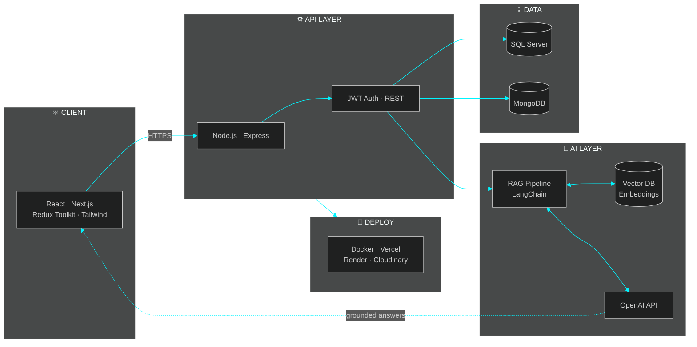
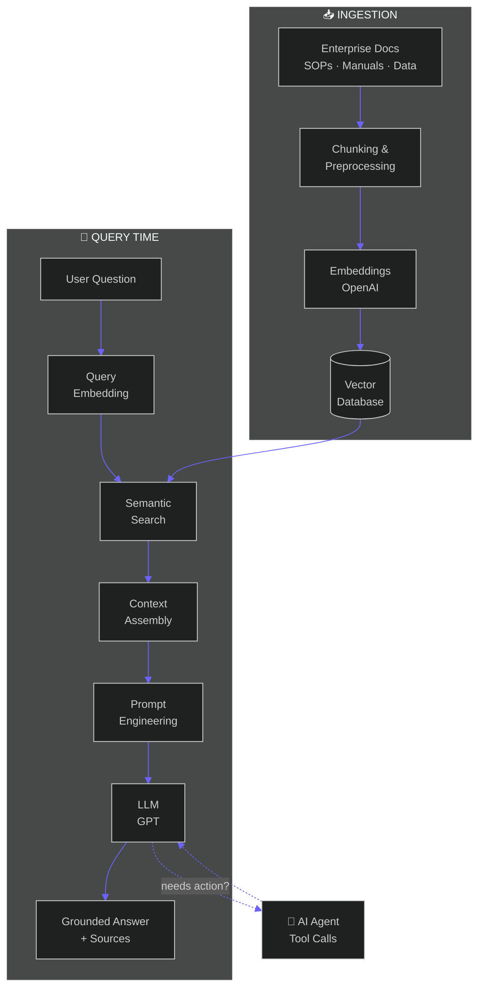
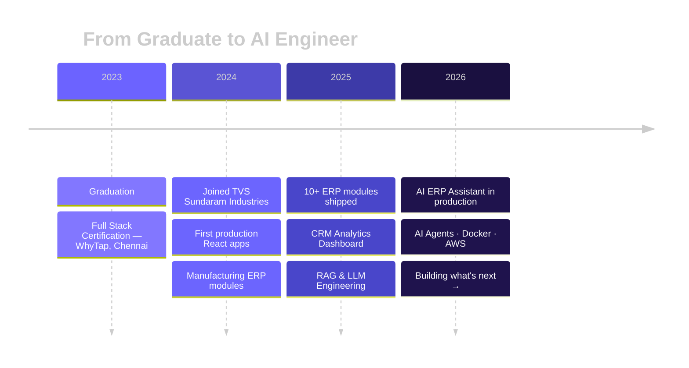

<!--
═══════════════════════════════════════════════════════════════════════════
  KAJA MOIDEEN — GITHUB PROFILE README
  Concept   : "Mission Control" — a futuristic AI engineer dashboard
  Theme     : Dark · Cyberpunk · Neon Blue #00F5FF · Violet #6C63FF · Void #050816
  Stack     : Capsule Render · Typing SVG · Skill Icons · Shields · Mermaid
              GitHub Readme Stats · Streak Stats · Activity Graph · Snake
  NOTE      : GitHub strips CSS/JS from READMEs. All "animation" here comes
              from animated SVG services and Mermaid — which is the maximum
              GitHub allows. Replace every {{PLACEHOLDER}} before publishing.
═══════════════════════════════════════════════════════════════════════════
-->

<!-- ═══════════════════════ 01 · HERO ═══════════════════════ -->

<div align="center">


<!-- System status bar -->


<br/><br/>

[](https://git.io/typing-svg)

<sub><code>$ whoami</code> → shipping AI features that factory teams actually use, every single day</sub>

</div>


<!-- ═══════════════════════ 02 · QUICK STATS DASHBOARD ═══════════════════════ -->

<div align="center">

## `> stats --live`

<table>
<tr>
<td align="center" width="14%">
<br/>
<sub><b>YEARS EXP</b></sub>
</td>
<td align="center" width="14%">
<br/>
<sub><b>ERP MODULES</b></sub>
</td>
<td align="center" width="14%">
<br/>
<sub><b>PROD APPS</b></sub>
</td>
<td align="center" width="14%">
<br/>
<sub><b>RAG SHIPPED</b></sub>
</td>
<td align="center" width="14%">
<br/>
<sub><b>FOLLOWERS</b></sub>
</td>
<td align="center" width="14%">
<br/>
<sub><b>STARS</b></sub>
</td>
<td align="center" width="14%">
<br/>
<sub><b>COMMITS</b></sub>
</td>
</tr>
</table>


</div>


<!-- ═══════════════════════ 03 · ABOUT ME — VS CODE EDITOR ═══════════════════════ -->

## `> cat about.ts`

<table width="100%">
<tr>
<td>

`● ● ●` &nbsp; `kaja-moideen.ts — visual-studio-code` &nbsp; 

```typescript
interface AIEngineer {
  name: string;
  compile(): Developer;
}

const kaja: AIEngineer = {
  name: "Kaja Moideen",

  role: ["Full Stack Developer", "AI Engineer"],
  company: "TVS Sundaram Industries Pvt Ltd",
  experience: "2+ years — enterprise production systems",

  domains: [
    "Manufacturing ERP",      // production · planning · inventory · dispatch
    "CRM & Sales Analytics",  // BI dashboards · KPIs · forecasting
    "AI Applications",        // RAG · agents · enterprise search
  ],

  frontend:  ["React", "Next.js", "TypeScript", "Redux Toolkit", "Tailwind", "Framer Motion"],
  backend:   ["Node.js", "Express", "REST APIs", "JWT Auth"],
  databases: ["SQL Server", "MongoDB", "MySQL"],
  ai:        ["OpenAI API", "LangChain", "RAG", "Vector DBs", "Prompt Engineering"],
  deploy:    ["Docker", "Vercel", "Netlify", "Render", "Cloudinary"],

  currentlyLearning: ["AI Agents at scale", "AWS", "System Design"],

  compile() {
    return "Ships AI features that factory teams use every day 🏭⚡";
  },
};

export default kaja;
```

</td>
</tr>
</table>


<!-- ═══════════════════════ 04 · SKILLS MATRIX ═══════════════════════ -->

<div align="center">

## `> skills --matrix`

</div>

<table width="100%">
<tr>
<td width="50%" valign="top">

### ⚛️ &nbsp;Frontend Engineering

<div align="center">

</div>

```text
React / Next.js     ████████████████████░  95%
Redux Toolkit       ███████████████████░░  90%
Tailwind CSS        ████████████████████░  95%
TypeScript          ████████████████░░░░░  80%
Framer Motion       █████████████████░░░░  85%
```

</td>
<td width="50%" valign="top">

### 🧠 &nbsp;AI Engineering

<div align="center">


</div>

```text
RAG Pipelines       ███████████████████░░  90%
Prompt Engineering  ████████████████████░  95%
LLM Integration     ███████████████████░░  90%
Embeddings          █████████████████░░░░  85%
AI Agents           ████████████████░░░░░  80%
```

</td>
</tr>
<tr>
<td width="50%" valign="top">

### ⚙️ &nbsp;Backend & Databases

<div align="center">

<br/>


</div>

```text
Node.js / Express   ███████████████████░░  90%
SQL Server          ███████████████████░░  90%
MongoDB             █████████████████░░░░  85%
REST API Design     ████████████████████░  95%
```

</td>
<td width="50%" valign="top">

### 🚀 &nbsp;DevOps & Platforms

<div align="center">

<br/>


</div>

```text
Git / GitHub        ███████████████████░░  90%
Vercel / Netlify    ███████████████████░░  90%
Docker              ██████████████░░░░░░░  70%  ← leveling up
AWS                 ██████████░░░░░░░░░░░  50%  ← learning
```

</td>
</tr>
</table>


<!-- ═══════════════════════ 05 · SYSTEM ARCHITECTURE ═══════════════════════ -->

<div align="center">

## `> architecture --render`

<sub>How my production systems are wired — from browser to LLM</sub>

</div>




<!-- ═══════════════════════ 06 · FEATURED PROJECTS ═══════════════════════ -->

<div align="center">

## `> projects --featured`

</div>

<table width="100%">
<tr>
<td width="50%" valign="top">

<div align="center">

### 🏭 Enterprise Manufacturing ERP

<!-- Replace with a real screenshot: 1280×640 recommended -->


 

</div>

Full-scale ERP powering tyre manufacturing — used on factory floors daily.

`Production` `Planning` `Inventory` `Dispatch` `PDI` `Quality` `CRM` `Reports`

  

<div align="center">

[]({{ERP_REPO_URL}})

</div>

</td>
<td width="50%" valign="top">

<div align="center">

### 🤖 AI ERP Assistant

<!-- Replace with a real screenshot: 1280×640 recommended -->


 

</div>

RAG-powered chat over enterprise knowledge — ChatGPT-style interface for internal teams.

`RAG Pipeline` `Semantic Search` `Knowledge Base` `AI Agent` `Enterprise Search`

   

<div align="center">

[]({{AI_ASSISTANT_REPO_URL}})

</div>

</td>
</tr>
<tr>
<td width="50%" valign="top">

<div align="center">

### 🛒 Customer Ordering Portal

<!-- Replace with a real screenshot: 1280×640 recommended -->


 

</div>

Self-service dealer portal for tyres & rims — browse, order, and track live.

`Product Search` `Customer Login` `Live Orders` `Order Tracking` `Dealer Dashboard`

  

<div align="center">

[]({{PORTAL_REPO_URL}})

</div>

</td>
<td width="50%" valign="top">

<div align="center">

### 📊 CRM Analytics Dashboard

<!-- Replace with a real screenshot: 1280×640 recommended -->


 

</div>

Real-time sales & manufacturing intelligence — 15+ chart components, global filter pipeline.

`Business Intelligence` `KPIs` `Forecasting` `Advanced Filters` `Recharts`

  

<div align="center">

[]({{CRM_REPO_URL}})

</div>

</td>
</tr>
</table>


<!-- ═══════════════════════ 07 · AI ENGINEER — RAG WORKFLOW ═══════════════════════ -->

<div align="center">

## `> rag-pipeline --trace`

<sub>The workflow behind my AI ERP Assistant — from raw docs to grounded answers</sub>

</div>



<div align="center">

    

</div>


<!-- ═══════════════════════ 08 · GITHUB ANALYTICS ═══════════════════════ -->

<div align="center">

## `> analytics --github`


<br/><br/>


<br/><br/>


<br/><br/>


<br/><br/>


### 🐍 &nbsp;Contribution Snake

<picture>
  <source media="(prefers-color-scheme: dark)" srcset="https://raw.githubusercontent.com/KAJA-MOIDEEN/KAJA-MOIDEEN/output/github-contribution-grid-snake-dark.svg"/>
  
</picture>

</div>


<!-- ═══════════════════════ 09 · DEVELOPER ACTIVITY / NOW ═══════════════════════ -->

<div align="center">

## `> now --running`

</div>

<table width="100%">
<tr>
<td width="33%" valign="top" align="center">

### 🔭 Now Building


Next.js full-stack products<br/>
AI-powered ERP workflows<br/>
Warehouse scanning systems

</td>
<td width="33%" valign="top" align="center">

### 🌱 Now Learning


Docker 🐳 & AWS ☁️<br/>
Multi-agent AI systems<br/>
Scalable system design

</td>
<td width="33%" valign="top" align="center">

### 🎯 Roadmap 2026


Ship an open-source AI tool<br/>
Cloud-native deployments<br/>
Contribute to OSS AI projects

</td>
</tr>
</table>


<!-- ═══════════════════════ 10 · TIMELINE ═══════════════════════ -->

<div align="center">

## `> journey --timeline`

</div>




<!-- ═══════════════════════ 11 · ACHIEVEMENTS ═══════════════════════ -->

<div align="center">

## `> achievements --unlocked`

<table>
<tr>
<td align="center" width="25%">
🏭<br/><b>Manufacturing ERP</b><br/><sub>10+ modules in daily production use across factory operations</sub>
</td>
<td align="center" width="25%">
🤖<br/><b>AI in Production</b><br/><sub>RAG assistant shipped to real enterprise users — not a demo</sub>
</td>
<td align="center" width="25%">
📊<br/><b>CRM Intelligence</b><br/><sub>Full analytics platform — 15+ components, real-time KPIs</sub>
</td>
<td align="center" width="25%">
⚡<br/><b>End-to-End Ownership</b><br/><sub>UI → API → DB → AI, designed and shipped solo</sub>
</td>
</tr>
<tr>
<td align="center" width="25%">
🎓<br/><b>Full Stack Certified</b><br/><sub>WhyTap, Chennai</sub>
</td>
<td align="center" width="25%">
🧠<br/><b>AI Engineering</b><br/><sub>RAG & LLM integration certification</sub>
</td>
<td align="center" width="25%">
🎨<br/><b>Modern UI Craft</b><br/><sub>Premium enterprise design systems</sub>
</td>
<td align="center" width="25%">
🔌<br/><b>Scalable APIs</b><br/><sub>REST architectures serving daily operations</sub>
</td>
</tr>
</table>

</div>


<!-- ═══════════════════════ 12 · VISITOR TELEMETRY ═══════════════════════ -->

<div align="center">

## `> telemetry --fun`


</div>


<!-- ═══════════════════════ 13 · CONTACT ═══════════════════════ -->

<div align="center">

## `> connect --init`

<sub>Always open to interesting problems, AI engineering roles, and good conversations.</sub>

<br/><br/>

[](https://linkedin.com/in/kaja-moideen)&nbsp;
[]({{PORTFOLIO_URL}})&nbsp;
[](https://github.com/KAJA-MOIDEEN)&nbsp;
[](mailto:kajamoideen3100@gmail.com)&nbsp;
[]({{RESUME_URL}})

<br/><br/>

[](https://git.io/typing-svg)

</div>

<!-- ═══════════════════════ 14 · FOOTER ═══════════════════════ -->


<!--
═══════════════════════════════════════════════════════════════════════════
  BEFORE PUBLISHING — CHECKLIST
  1. Replace {{ERP_SCREENSHOT_URL}}, {{AI_ASSISTANT_SCREENSHOT_URL}},
     {{PORTAL_SCREENSHOT_URL}}, {{CRM_SCREENSHOT_URL}} with real screenshots
     (upload to the repo /assets folder, use raw URLs, 1280×640 works best).
  2. Replace {{ERP_REPO_URL}}, {{AI_ASSISTANT_REPO_URL}}, {{PORTAL_REPO_URL}},
     {{CRM_REPO_URL}} with repo/case-study links (or remove the buttons for
     private enterprise projects).
  3. Replace {{PORTFOLIO_URL}} and {{RESUME_URL}}.
  4. Snake animation: keep the Platane/snk GitHub Action workflow that
     generates github-contribution-grid-snake-dark.svg on the output branch.
  5. Streak stats: streak-stats.demolab.com is sometimes rate-limited; you
     can self-host it on Vercel like your readme-stats instance.
═══════════════════════════════════════════════════════════════════════════
-->
